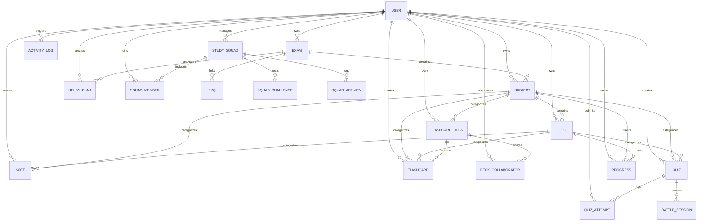

# 🗄️ Database Architecture & Model Relationships

This document provides a comprehensive guide to the **OpenPrep AI** PostgreSQL database schema, Sequelize ORM models, Entity-Relationship (ER) diagrams, and model association rules.

---

## 🛠️ Overview & Configuration

- **Database Engine**: PostgreSQL
- **ORM**: Sequelize ORM (Node.js)
- **Primary Key Strategy**: UUID (v4) generated via `DataTypes.UUIDV4` across all core models.
- **Timestamp Tracking**: Standard `createdAt` and `updatedAt` timestamps enabled automatically (`timestamps: true`).
- **Configuration File**: [`backend/config/db.js`](../backend/config/db.js)
- **Associations Registry**: [`backend/models/index.js`](../backend/models/index.js)

---

## 🗺️ Entity-Relationship (ER) Diagram

The following Mermaid diagram outlines the relationships between OpenPrep AI's primary data models:

---

## 📄 Core Model Specifications

### 1. User Model (`User`)
- **File**: [`backend/models/User.js`](../backend/models/User.js)
- **Table Name**: `Users`

| Column | Type | Attributes / Constraints | Description |
| :--- | :--- | :--- | :--- |
| `id` | `UUID` | Primary Key, Default: `UUIDV4` | Unique user identifier |
| `name` | `STRING` | Not Null | Student display name |
| `email` | `STRING` | Not Null, Unique | User login email address |
| `password` | `STRING` | Nullable (for OAuth) | Bcrypt password hash |
| `role` | `ENUM` | Defaults: `'student'` (`'student'`, `'contributor'`, `'admin'`) | System authorization role |
| `authProvider` | `ENUM` | Defaults: `'local'` (`'local'`, `'google'`, `'github'`) | Primary authentication method |
| `streakCount` | `INTEGER` | Default: `0` | Consecutive active study days |
| `studyHours` | `FLOAT` | Default: `0` | Total recorded study hours |
| `xp` | `INTEGER` | Default: `0` | Gamification Experience Points |
| `level` | `INTEGER` | Default: `1` | Current gamification user level |
| `sm2EasyFactorModifier` | `FLOAT` | Default: `1.0` | SuperMemo SM-2 global algorithm modifier |
| `sm2IntervalModifier` | `FLOAT` | Default: `1.0` | SuperMemo SM-2 interval multiplier |
| `pushSubscription` | `JSONB` | Nullable | Web Push notification payload configuration |
| `badges` | `JSONB` | Default: `[]` | Earned badge objects |

---

### 2. Note Model (`Note`)
- **File**: [`backend/models/Note.js`](../backend/models/Note.js)
- **Table Name**: `Notes`

| Column | Type | Attributes / Constraints | Description |
| :--- | :--- | :--- | :--- |
| `id` | `UUID` | Primary Key, Default: `UUIDV4` | Unique note identifier |
| `user` | `UUID` | Foreign Key (`Users.id`), Not Null | Note author |
| `subject` | `UUID` | Foreign Key (`Subjects.id`), Not Null | Associated subject |
| `topic` | `UUID` | Foreign Key (`Topics.id`), Nullable | Associated chapter topic |
| `title` | `STRING` | Not Null | Note document title |
| `content` | `TEXT` | Nullable | Markdown note content |
| `fileUrl` | `STRING` | Nullable | Path to attached file/PDF upload |
| `category` | `ENUM` | Defaults: `'Lecture Notes'` | Note category type |
| `aiSummary` | `JSONB` | Nullable | Key takeaways and AI summary JSON |
| `tags` | `ARRAY(STRING)`| Default: `[]` | Searchable tag list |
| `docState` | `BLOB` | Nullable | Binary Yjs CRDT state for real-time collaboration |
| `isCollaborative` | `BOOLEAN` | Default: `false` | Enables multi-user collaborative editing |

---

### 3. Flashcard Model (`Flashcard`)
- **File**: [`backend/models/Flashcard.js`](../backend/models/Flashcard.js)
- **Table Name**: `Flashcards`

| Column | Type | Attributes / Constraints | Description |
| :--- | :--- | :--- | :--- |
| `id` | `UUID` | Primary Key, Default: `UUIDV4` | Unique flashcard identifier |
| `user` | `UUID` | Foreign Key (`Users.id`), Not Null | Creator user ID |
| `subject` | `UUID` | Foreign Key (`Subjects.id`), Not Null | Target subject |
| `topic` | `UUID` | Foreign Key (`Topics.id`), Nullable | Target topic |
| `deckId` | `UUID` | Foreign Key (`FlashcardDecks.id`), Nullable | Containing deck ID |
| `front` | `TEXT` | Not Null | Question or prompt text |
| `back` | `TEXT` | Not Null | Answer or explanation text |
| `interval` | `INTEGER` | Default: `1` | Spaced Repetition review interval (days) |
| `repetitions` | `INTEGER` | Default: `0` | Consecutive successful reviews |
| `efactor` | `FLOAT` | Default: `2.5` | SuperMemo SM-2 Easiness Factor |
| `nextReviewDate` | `DATE` | Default: `NOW` | Next scheduled review date |

---

### 4. FlashcardDeck Model (`FlashcardDeck`)
- **File**: [`backend/models/FlashcardDeck.js`](../backend/models/FlashcardDeck.js)
- **Table Name**: `FlashcardDecks`

| Column | Type | Attributes / Constraints | Description |
| :--- | :--- | :--- | :--- |
| `id` | `UUID` | Primary Key, Default: `UUIDV4` | Deck ID |
| `user` | `UUID` | Foreign Key (`Users.id`), Not Null | Deck owner |
| `subject` | `UUID` | Foreign Key (`Subjects.id`), Nullable | Deck subject |
| `title` | `STRING` | Not Null | Deck title |
| `description` | `TEXT` | Nullable | Deck description |
| `isPublic` | `BOOLEAN` | Default: `false` | Community market sharing toggle |
| `isCollaborative` | `BOOLEAN` | Default: `false` | Enables shared editing via `DeckCollaborators` |

---

### 5. Quiz & QuizAttempt Models (`Quiz`, `QuizAttempt`)
- **Files**: [`Quiz.js`](../backend/models/Quiz.js) & [`QuizAttempt.js`](../backend/models/QuizAttempt.js)

#### `Quiz`
- `id` (`UUID`, Primary Key)
- `createdBy` (`UUID`, Foreign Key -> `Users.id`)
- `subject` (`UUID`, Foreign Key -> `Subjects.id`)
- `topic` (`UUID`, Foreign Key -> `Topics.id`)
- `title` (`STRING`, Required)
- `type` (`ENUM`: `'AI_Generated'`, `'Manual'`)
- `questions` (`JSONB`: array of questions with options, answer indices, and explanations)

#### `QuizAttempt`
- `id` (`UUID`, Primary Key)
- `user` (`UUID`, Foreign Key -> `Users.id`)
- `quiz` (`UUID`, Foreign Key -> `Quizzes.id`)
- `score` (`INTEGER`, Obtained points)
- `totalQuestions` (`INTEGER`, Total question count)
- `answers` (`JSONB`, User selected answers)
- `durationSeconds` (`INTEGER`, Time spent in seconds)
- `percentage` (`FLOAT`, Percentage score)

---

### 6. Academic Hierarchy (`Exam`, `Subject`, `Topic`)

- **`Exam`**: High-level target exam (e.g., NCLEX, USMLE, SAT, JEE). Belongs to `User`.
- **`Subject`**: Academic subject under an exam (e.g., Pharmacology, Organic Chemistry). Belongs to `Exam` and `User`.
- **`Topic`**: Specific unit/chapter under a subject. Belongs to `Subject` and `User`. Tracks confidence status (`'Weak'`, `'Medium'`, `'Strong'`) and exam weightage.

---

### 7. Study Plan Model (`StudyPlan`)
- **File**: [`backend/models/StudyPlan.js`](../backend/models/StudyPlan.js)

- `id` (`UUID`, Primary Key)
- `user` (`UUID`, Foreign Key -> `Users.id`)
- `exam` (`UUID`, Foreign Key -> `Exams.id`)
- `startDate` & `endDate` (`DATE`)
- `dailyGoals` (`JSONB`: array of dated goals containing task titles, completion state, and topic references)
- `status` (`ENUM`: `'active'`, `'completed'`, `'archived'`)

---

## 🔗 Association Rules & Relationship Types

Associations are globally declared in [`backend/models/index.js`](../backend/models/index.js).

### 1. One-to-Many Relationships (`1:N`)

Implemented via `hasMany` on the parent model and `belongsTo` on the child model with `onDelete: 'CASCADE'`:

- **User Ownership**:
  - `User.hasMany(Note)` / `Note.belongsTo(User)`
  - `User.hasMany(Flashcard)` / `Flashcard.belongsTo(User)`
  - `User.hasMany(Quiz)` / `Quiz.belongsTo(User)`
  - `User.hasMany(QuizAttempt)` / `QuizAttempt.belongsTo(User)`
  - `User.hasMany(StudyPlan)` / `StudyPlan.belongsTo(User)`
  - `User.hasMany(Progress)` / `Progress.belongsTo(User)`

- **Academic Hierarchy**:
  - `Exam.hasMany(Subject)` / `Subject.belongsTo(Exam)`
  - `Subject.hasMany(Topic)` / `Topic.belongsTo(Subject)`
  - `Subject.hasMany(Note)` / `Note.belongsTo(Subject)`
  - `Subject.hasMany(Flashcard)` / `Flashcard.belongsTo(Subject)`

- **Decks & Quizzes**:
  - `FlashcardDeck.hasMany(Flashcard)` / `Flashcard.belongsTo(FlashcardDeck)`
  - `Quiz.hasMany(QuizAttempt)` / `QuizAttempt.belongsTo(Quiz)`

---

### 2. Many-to-Many Relationships (`N:M`)

Implemented using dedicated junction tables that store foreign keys and permission metadata:

- **Deck Collaboration (`User` <-> `FlashcardDeck`)**:
  - Junction Table: `DeckCollaborators`
  - `FlashcardDeck.hasMany(DeckCollaborator)`
  - `User.hasMany(DeckCollaborator)`
  - Stores `role` (`'viewer'`, `'editor'`, `'admin'`) and `status` (`'pending'`, `'accepted'`).

- **Study Squad Memberships (`User` <-> `StudySquad`)**:
  - Junction Table: `SquadMembers`
  - `StudySquad.hasMany(SquadMember)`
  - `User.hasMany(SquadMember)`
  - Stores member role (`'admin'`, `'member'`) and joined timestamp.

- **Gamification Badges (`User` <-> `Badge`)**:
  - Junction Table: `UserBadges`
  - `Badge.hasMany(UserBadge)`
  - `User.hasMany(UserBadge)`
  - Links users to earned badges with unlock dates.
