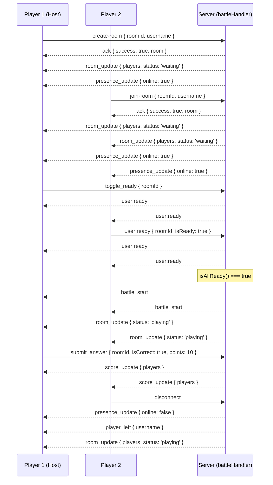

# 🔌 Socket.IO Events Reference

OpenPrep AI uses [Socket.IO](https://socket.io/) for two real-time features:

- **Battle Arena** — multiplayer live quiz battles (`backend/sockets/battleHandler.js`)
- **Study Group Chat** — real-time group chat rooms (`backend/sockets/chatHandler.js`)

Both handlers are registered on the same Socket.IO server instance in `backend/server.js`:

```js
const io = new Server(server, {
  cors: { origin: getSocketCorsOrigin(), methods: ['GET', 'POST'], credentials: true },
  pingTimeout: 60000,
  pingInterval: 25000,
});

require('./sockets/battleHandler')(io);
require('./sockets/chatHandler')(io);
```

There is no dedicated socket namespace or path configured — clients connect to the default `/` namespace exposed by the same HTTP server as the REST API.

---

## 🗡️ Battle Arena Events (`battleHandler.js`)

Room state is kept in-memory (`rooms[roomId]`) and has this shape:

```js
{
  id: 'ROOMID',
  name: 'Battle Room',
  password: '',           // empty string = public room
  players: {
    '<socket.id>': {
      username: 'Anonymous',
      score: 0,
      isReady: false,
      online: true,
    },
  },
  status: 'waiting',       // 'waiting' | 'playing'
  questions: [],
}
```

### Client → Server

| Event | Payload | Description |
| --- | --- | --- |
| `create-room` | `{ roomId, username, roomName?, password? }` | Creates a room (if it doesn't exist) and joins it. Accepts an ack `callback`. |
| `join-room` | `{ roomId, username, password? }` | Joins an existing (or new) room. Accepts an ack `callback`. |
| `join_room` | `{ roomId, username }` or a plain `roomId` string | Legacy/alternate alias for `join-room`, kept for backward compatibility. Accepts an ack `callback`. |
| `request_sync` | `{ roomId }` | Asks the server to re-emit the current room state (e.g. after the browser tab regains focus). |
| `toggle_ready` | `{ roomId }` | Flips the calling player's ready flag. |
| `user:ready` | `{ roomId, isReady }` | Explicitly sets the calling player's ready flag. |
| `user:typing` | `{ roomId, isTyping }` | Broadcasts a typing indicator to everyone else in the room. |
| `submit_answer` | `{ roomId, isCorrect, points? }` | Submits an answer; `points` (default `10`) is added to the score only if `isCorrect` is true and the room is `playing`. |
| `disconnect` | *(none — built-in Socket.IO event)* | Cleans up the player from whichever room they were in. |

**`create-room` / `join-room` ack response:**
```js
// success
{ success: true, roomId, room: { id, name, password }, isPrivate }
// failure
{ success: false, message: 'A room code is required.' }
// wrong password
{ success: false, requiresPassword: true, message: 'Incorrect password' }
```

### Server → Client

| Event | Payload | Emitted when |
| --- | --- | --- |
| `room_update` | `{ players, status }` | Any time the room's player list or status changes (join, ready toggle, disconnect, sync request). |
| `presence_update` | `{ socketId, username, online }` | A player joins or disconnects. |
| `user:ready` | `{ socketId, username, isReady }` | A player's ready state changes. |
| `user:typing` | `{ socketId, username, isTyping }` | A player starts/stops typing (sent to everyone **except** the sender). |
| `score_update` | `{ players }` | A correct/incorrect answer is submitted while the room is `playing`. |
| `battle_start` | `{ message }` | All players in the room are ready (room moves from `waiting` to `playing`). |
| `player_left` | `{ username }` | A player disconnects and other players remain in the room. |

### Match Lifecycle Sequence



---

## 💬 Study Group Chat Events (`chatHandler.js`)

### Client → Server

| Event | Payload | Description |
| --- | --- | --- |
| `join_chat_room` | `{ roomId, username }` | Joins a chat room and adds the user to the active user list. |
| `send_chat_message` | `{ roomId, messageText }` | Broadcasts a chat message to everyone in the room, including the sender. |
| `user:typing` | `{ roomId, isTyping }` | Broadcasts a typing indicator (sent to everyone **except** the sender). |
| `leave_chat_room` | `{ roomId }` | Explicitly leaves a chat room. |
| `disconnect` | *(none — built-in Socket.IO event)* | Cleans up the user from whichever chat room they were in. |

### Server → Client

| Event | Payload | Emitted when |
| --- | --- | --- |
| `chat_room_update` | `{ users }` | The active user list for a room changes (join, leave, disconnect). |
| `new_chat_message` | `{ id, sender, text, timestamp }` | A new chat message is sent. |
| `user:typing` | `{ username, isTyping }` | A user starts/stops typing, or on leave/disconnect (`isTyping: false`) to clear stale indicators. |

---

## Notes for Contributors

- Both handlers store room state **in-memory** on the Node process — this does not survive a server restart and won't scale across multiple server instances without a shared store (e.g. Redis).
- Event payloads are not currently validated with a schema library; keep this in mind when adding new fields.
- See [`docs/backend-architecture.md`](./backend-architecture.md) for how the socket layer fits into the rest of the backend.