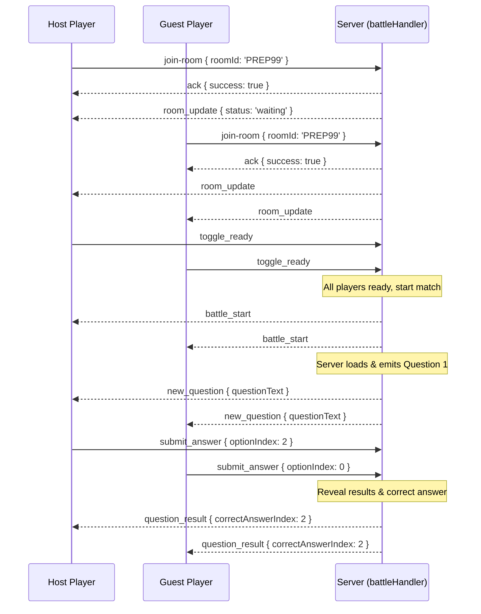

# 🔌 Socket.IO Events Reference

OpenPrep AI uses [Socket.IO](https://socket.io/) for two real-time features:

- **Battle Arena** — multiplayer live quiz battles (`backend/sockets/battleHandler.js`)
- **Study Group Chat** — real-time group chat rooms (`backend/sockets/chatHandler.js`)

Both handlers are registered on the same Socket.IO server instance in `backend/server.js`:

```js
const io = new Server(server, {
  cors: { origin: getSocketCorsOrigin(), methods: ['GET', 'POST'], credentials: true },
  pingTimeout: 60000,
  pingInterval: 25000,
});

require('./sockets/battleHandler')(io);
require('./sockets/chatHandler')(io);
```

There is no dedicated socket namespace or path configured — clients connect to the default `/` namespace exposed by the same HTTP server as the REST API.

## 🗡️ Battle Arena Events (`battleHandler.js`)

Room state is kept in-memory using `roomManager` and has this shape:

```js
{
  roomCode: 'PREP99',
  roomName: 'Biology Match',
  password: '',           // empty string = public room
  hostUserId: 'host-uuid',
  hostSocketId: 'host-socket-id',
  questionCount: 5,
  timePerQuestion: 15,
  status: 'waiting',       // 'waiting' | 'playing' | 'finished'
  players: {
    '<socket.id>': {
      userId: 'user-uuid',
      username: 'Alice',
      score: 0,
      correctCount: 0,
      timeSpentSumMs: 0,
      isReady: false,
      online: true,
      answeredThisQuestion: false,
    },
  },
  quiz: { ... },
  currentQuestionIndex: 0,
  questionActive: false,
  timeRemaining: 15,
}
```

### Authentication Handshake

Before any events are accepted, the Socket.io server checks the handshake auth headers:
- **Token Location**: `socket.handshake.auth.token`
- **Verification**: Verified using `jwt.verify` against `JWT_SECRET`. Invalid tokens reject connection.

### Client → Server

| Event | Payload | Description |
| --- | --- | --- |
| `join-room` | `{ roomId, password? }` | Joins a battle lobby by its 6-character room code. Accepts an ack `callback`. |
| `toggle_ready` | `{ roomId }` | Toggles the calling player's ready flag. Auto-starts if all are ready. |
| `start-game` | `{ roomId }` | Triggers immediate game start. Only permitted by the host player. |
| `submit_answer` | `{ roomId, optionIndex, timeSpentMs }` | Submits option selection for the current question index. Score calculated with speed bonuses. |
| `leave-room` | `{ roomId }` | Leaves the room, initiating a 30s re-connection grace period. |

### Server → Client

| Event | Payload | Emitted when |
| --- | --- | --- |
| `room_update` | `{ players, status, hostUserId? }` | Any player joins, gets ready, disconnects, or submits an option. |
| `host_changed` | `{ hostUserId, username }` | The host disconnects and another online participant is assigned. |
| `battle_start` | *(none)* | Game transitions from waiting room to active quiz. |
| `new_question` | `{ questionIndex, questionText, options, totalQuestions, timeLimit }` | Next quiz question is broadcast to all participants. |
| `timer_tick` | `{ timeRemaining }` | Ticked every second by the server-authoritative countdown. |
| `question_result` | `{ correctAnswerIndex, correctAnswerText, explanation, players }` | Timer runs out or all participants have submitted answers. |
| `battle_finished` | `{ players }` | All questions completed. Standings compiled and XP distributed. |

### Match Lifecycle Sequence



---

## 💬 Study Group Chat Events (`chatHandler.js`)

### Client → Server

| Event | Payload | Description |
| --- | --- | --- |
| `join_chat_room` | `{ roomId, username }` | Joins a chat room and adds the user to the active user list. |
| `send_chat_message` | `{ roomId, messageText }` | Broadcasts a chat message to everyone in the room, including the sender. |
| `user:typing` | `{ roomId, isTyping }` | Broadcasts a typing indicator (sent to everyone **except** the sender). |
| `leave_chat_room` | `{ roomId }` | Explicitly leaves a chat room. |
| `disconnect` | *(none — built-in Socket.IO event)* | Cleans up the user from whichever chat room they were in. |

### Server → Client

| Event | Payload | Emitted when |
| --- | --- | --- |
| `chat_room_update` | `{ users }` | The active user list for a room changes (join, leave, disconnect). |
| `new_chat_message` | `{ id, sender, text, timestamp }` | A new chat message is sent. |
| `user:typing` | `{ username, isTyping }` | A user starts/stops typing, or on leave/disconnect (`isTyping: false`) to clear stale indicators. |

---

## Notes for Contributors

- Both handlers store room state **in-memory** on the Node process — this does not survive a server restart and won't scale across multiple server instances without a shared store (e.g. Redis).
- Event payloads are not currently validated with a schema library; keep this in mind when adding new fields.
- See [`docs/backend-architecture.md`](./backend-architecture.md) for how the socket layer fits into the rest of the backend.